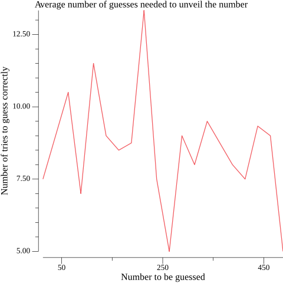

# Index

## Guess.go

### Description
The program will present the user with the "Guess the number" task - 
and then ask the user for this number and check if the previously drawn number is the same. 
If so, congratulations are to come and the program ends. If not, the program should write whether
the number given by the user is "Too Small" or "Too Big". 
The questions are then repeated until the user finally guesses or interrupts the program.

Furthermore app has additional functionalities:
* leaderboards
* resign option
* csv DB

### Example playthrough
```text
**********************
Welcome to THE GAME!
Highscore (TOP 3):
1. maestro in 5 tries (2022-April-4 18:42)
2. king in 5 tries (2022-April-5 14:7)
3. wowow in 6 tries (2022-April-5 9:53)
**********************

Click Enter to continue...

**********************
New Game!
You have to guess number between 1 and 500.
You can type "END" if you want to resign.
Enter number:	250
No, 250 is too small!
Enter number:	375
No, 375 is too big!
Enter number:	300
No, 300 is too big!
Enter number:	275
No, 275 is too small!
Enter number:	287
No, 287 is too small!
Enter number:	293
No, 293 is too small!
Enter number:	297
No, 297 is too big!
Enter number:	295
No, 295 is too big!
Enter number:	294

Congratulations!
You've guessed the number "294"
You've made in in 9 tries
Enter your nickanme:	nickname


Play again? [YES/NO]
no

1. king in 5 tries (2022-April-5 14:7)
2. maestro in 5 tries (2022-April-4 18:42)
3. wowow in 6 tries (2022-April-5 9:53)
4. luckyPunch in 6 tries (2022-April-5 9:59)
5. dexter in 6 tries (2022-April-5 14:14)
6. maximus in 7 tries (2022-April-5 9:55)
7. lucky7 in 7 tries (2022-April-5 9:52)
8. brooo in 7 tries (2022-April-5 9:49)
9. newyork in 7 tries (2022-April-5 9:49)
10. player1 in 7 tries (2022-April-5 14:10)

Goodbye! See you soon :)

Process finished with the exit code 0
```

## DataAnalysis.go

### Description
Contains basic analysis of played games, providing informations like:
* Average tries
* Number of games
* Hardest/Easiest numbers to guess

### Example report
```text
***********************
-----OVERALL STATS-----
There were 41 games played
Number was guessed average in 9.15 round
Median of tries to guess the number was 9.00 
Average number to be guessed was 243 
***********************
-----RANGE  STATS-----
In range <1, 26) number was guessed in average 7.50 tries.
In range <26, 51) number was guessed in average NaN tries.
In range <51, 76) number was guessed in average 10.50 tries.
In range <76, 101) number was guessed in average 7.00 tries.
In range <101, 126) number was guessed in average 11.50 tries.
In range <126, 151) number was guessed in average 9.00 tries.
In range <151, 176) number was guessed in average 8.50 tries.
In range <176, 201) number was guessed in average 8.75 tries.
In range <201, 226) number was guessed in average 13.33 tries.
In range <226, 251) number was guessed in average 7.50 tries.
In range <251, 276) number was guessed in average 5.00 tries.
In range <276, 301) number was guessed in average 9.00 tries.
In range <301, 326) number was guessed in average 8.00 tries.
In range <326, 351) number was guessed in average 9.50 tries.
In range <351, 376) number was guessed in average NaN tries.
In range <376, 401) number was guessed in average 8.00 tries.
In range <401, 426) number was guessed in average 7.50 tries.
In range <426, 451) number was guessed in average 9.33 tries.
In range <451, 476) number was guessed in average 9.00 tries.
In range <476, 501) number was guessed in average 5.00 tries.
************************
---HARDEST VS EASIEST---
Easiest to gues is range <251, 276) with average 5.00 tries.
Hardest to gues is range <201, 226) with average 13.33 tries.
************************
```

Plot:


