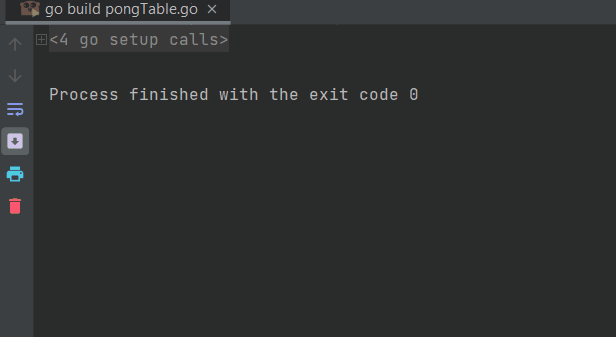

# Index

## pongTable.go

Concurrency based ping pong game

* Main logic:
    * Ball is passed between pre-declared opponents. After passing it, player/racket waits for
    ball that should come from personal channel.
      ```go
        func (thisRacket *Racket) passTheBall() {
          for {
              fmt.Printf("%s: %s\n", thisRacket.name, thisRacket.motto)
              time.Sleep(1000 * time.Millisecond)
              *thisRacket.opponent.receive <- Ball("")
              <-*thisRacket.receive
          }
        }
      ```
      
* Details:
  
    * After initialization of rackets, opponents must be set for each:
    ```go
    func main() {
        fmt.Println("Test")
        racket1 := NewRacket("Player1", "Ping!")
        racket2 := NewRacket("Player2", "Pong!")
        racket1.setOpponent(racket2)
        racket2.setOpponent(racket1)
        //...
    }
    ```
  
    * Then we have **getReady** and **serve** methods. 
      * getReady starts loop but sets first action as "waiting for the ball"
      * serve also starts loop but first action is passing (serving) the ball (someone has to be first)
    ```go
    func (thisRacket *Racket) getReady() {
        go func() {
            <-*thisRacket.receive
            go thisRacket.passTheBall()
        }()
    }
  
    func (thisRacket *Racket) serve() {
        go thisRacket.passTheBall()
    }
    ```
  * To start the game, all rackets except "first player" needs to be set ready and then "first player"
    may start the game. All go routines are killed as soon as main function ends 
    that's why some time is put to prevent it.
    ```go
    func main() {
        // ...
        racket2.getReady()
        racket1.serve()
        time.Sleep(20000 * time.Millisecond)
    }
    ```
    
### Ping Pong in action:


